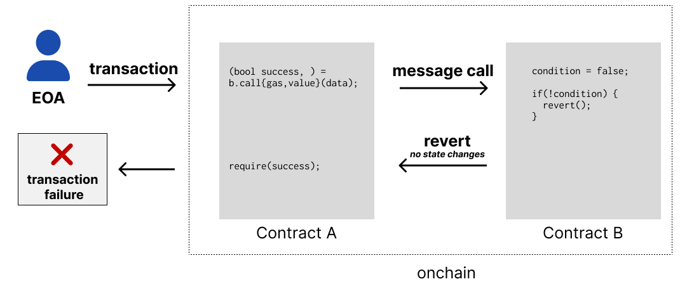

# Revert

- We talk to a contract with message calls
- A contract can `REVERT` a call, negating all state changes
- Each calling contract can choose to handle that success, or `REVERT` as well

---



---

## Message Call Revert

- 🙅‍♀️ No state changes occur
- 🙅‍♀️ No value is transfered
- 🙅‍♀️ No logs are emitted
- ⛽️ Gas is still spent

---

## Require

Often you'll see `require` used like this:

```js
contract X {
  // shorthand!
  address owner = msg.sender;

  function ownerOnly() external {
    // REVERT if not the owner
    require(msg.sender == owner, "only owner!");
    // do something owner-y
  }
}
```

---

## Revert

Revert can be used with a string `revert("Unauthorized")` or, better yet:

```js
contract X {
  // @notice a non-privileged user attempted to access an admin-only method
  error Unauthorized();

  function adminOnly() external {
    if (!isAdmin(msg.sender)) {
      revert Unauthorized();
    }
  }
}
```

👆⛽️ _Gas Efficient_!

---

## Assert

Use `assert` with things that should not happen:

```js
contract X {
  function withdraw() external {
    uint balance = getBalance(msg.sender);
    sendBalance(msg.sender);

    // they should not still have a balance!
    assert(getBalance(msg.sender) == 0);
  }
}
```
