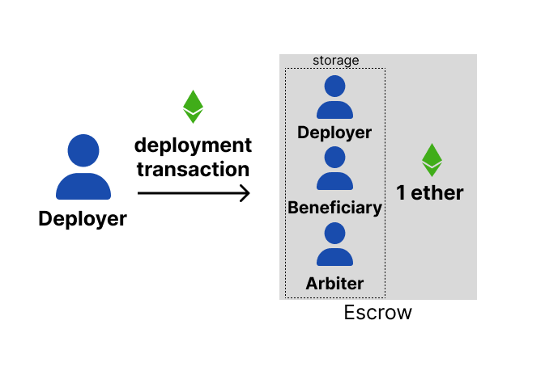
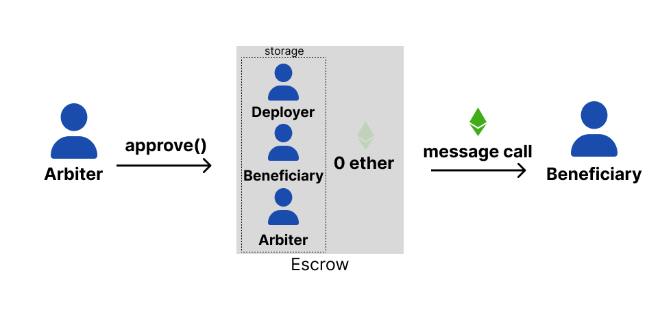

# Escrow: Let's get real world!

- 🧠 you now understand storage, value/data transfer between smart contracts
- 🎉 you can now produce useful solidity contracts!
- 📜 let's build an escrow agreement between 2 parties to transfer some value, arbitrated by a 3rd party

---



---



---

## Let the world know! 📣

Emit an **event** when something important happens!

```js
contract Escrow {
  event Approved(uint);

  function approve() external {
    // ...

    emit Event(address(this).balance);
  }
}
```
